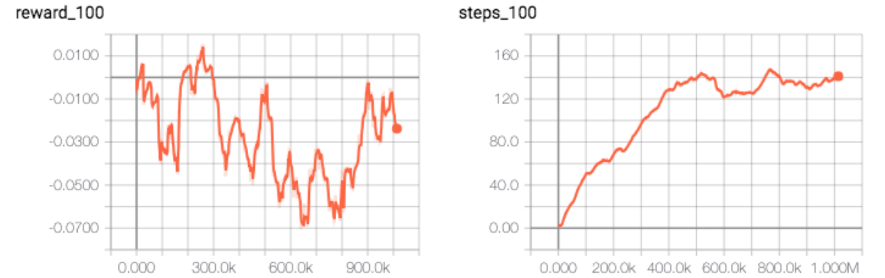
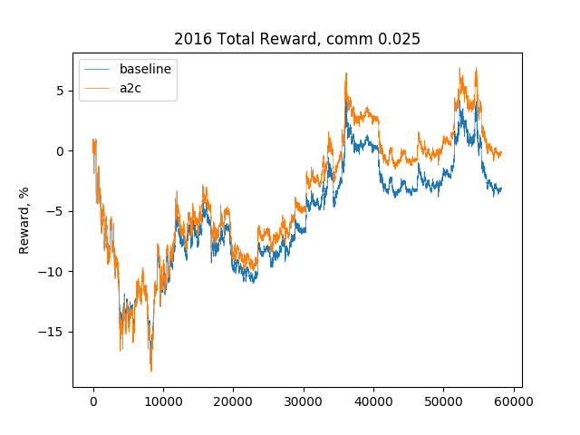
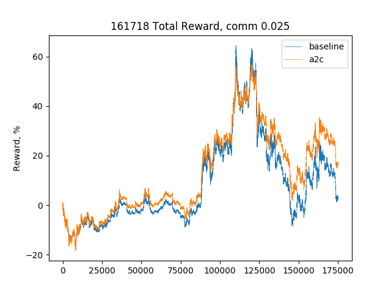

# TradingBot Demo

## 框架
```
.
├── __init__.py
├── common
│   ├── __init__.py
│   ├── agent.py
│   ├── experience.py
│   ├── helper.py
│   └── writer.py
├── data
│   ├── 000001_161718.csv
│   ├── 000001_2016.csv
├── lib
│   ├── __init__.py
│   ├── data.py
│   ├── environ.py
│   ├── models.py
│   └── validation.py
├── plots
├── runs
├── saves
├── 01_play_dqn.py
├── 01_train_dqn.py
├── 02_play_a2c.py
├── 02_train_a2c.py
├── 03_train_a3c.py
└── README.md


```

## 目的

```
给定某只股票某年的分钟级数据，通过强化学习训练机器得到最佳操盘模型，最后用同只股票其他年份的分钟级数据进行回测，考察其表现
```

## 原理
1. 数据处理（data.py），应用Ta-lib从原始分钟级数据（Open, High, Low, Close, Volume)提取出若干训练因子（RSI, SAR, WILLR, MACD等）
2. 决策模型（models.py)，经过处理的数据作为观察值state导入深度学习模型得出policy
3. 环境互动（environ.py)，将policy通过Agent（如epsilon-greedy或Probability selection）获得对应的动作action（持有或空仓），并和环境互动后得到下一分钟的观察值next_state、盈亏比例reward、回合完成的指令done、和其他信息info
4. 训练模型(train.py)，得到若干(next_state, reward, done, info）后，根据所选的强化学习类型（DQN或Actor-critic）计算loss并回溯优化模型参数，保存最佳参数并通过tensorboard监测模型表现

```


```

```


```

## 测试
1. 数据：平安银行（000001.SZ）2016年的分钟级数据（000001_2016.csv），数据来源：聚宽
2. 框架：Pytorch 1.1.0 (CUDA version）
3. 平台：Google Colab (Tesla K80 GPU)
4. 模型：1d CNN (Convolutional Neural Network)
5. 模式：A2C (Advantage Actor-Critic)
```
A2CConv1d(
  (conv): Sequential(
    (0): Conv1d(21, 128, kernel_size=(5,), stride=(1,))
    (1): ReLU()
    (2): Conv1d(128, 128, kernel_size=(5,), stride=(1,))
    (3): ReLU()
  )
  (policy): Sequential(
    (0): Linear(in_features=5376, out_features=512, bias=True)
    (1): ReLU()
    (2): Linear(in_features=512, out_features=2, bias=True)
  )
  (value): Sequential(
    (0): Linear(in_features=5376, out_features=512, bias=True)
    (1): ReLU()
    (2): Linear(in_features=512, out_features=1, bias=True)
  )
)
```

## 表现
1. reward不理想，在一定步数后不稳定甚至降低，表明模型可能陷入了梯度局部最小值而非全局最小值，便不再优化
2. step逐步提高，表明机器发现在有手续费的时候，操作不宜太频繁



```


```

## 回测

### 2016年回测

- 手续费：买入卖出各万分之二点五
- 基准线：2016年初买入平安银行并持有一年不动的收益率
```
100: reward=-0.152, baseline_reward=-0.110
200: reward=-0.138, baseline_reward=-0.110
300: reward=-0.131, baseline_reward=-0.110
......
58000: reward=-0.190, baseline_reward=-3.183
58100: reward=-0.301, baseline_reward=-3.293
58200: reward=-0.073, baseline_reward=-3.074
```
- 回测结果：黄色为模型收益、蓝色为基准收益


> 打败基准3个百分点

### 2016-2018年回测

- 手续费：买入卖出各万分之二点五
- 基准线：2016年初买入平安银行并持有三年不动的收益率
```
100: reward=-0.152, baseline_reward=-0.110
200: reward=-0.138, baseline_reward=-0.110
300: reward=-0.131, baseline_reward=-0.110
......
163700: reward=30.293, baseline_reward=19.210
163800: reward=32.684, baseline_reward=22.064
163900: reward=31.196, baseline_reward=20.198
```
- 回测结果：黄色为模型收益、蓝色为基准收益


> 打败基准11个百分点

## 优化
1. 增加训练数据，比如用多年或多只股票的数据反应更宏观的行情
2. 优化训练因子，目前只是简单丢给模型一堆技术指标，并未进行筛选
3. 尝试不同模型，如更擅长时间序列预测的RNN(Recurrent Neural Network)
4. 优化学习方法，将AlphaGo的训练方法如Monte-Carlo Tree Search等应用上去
